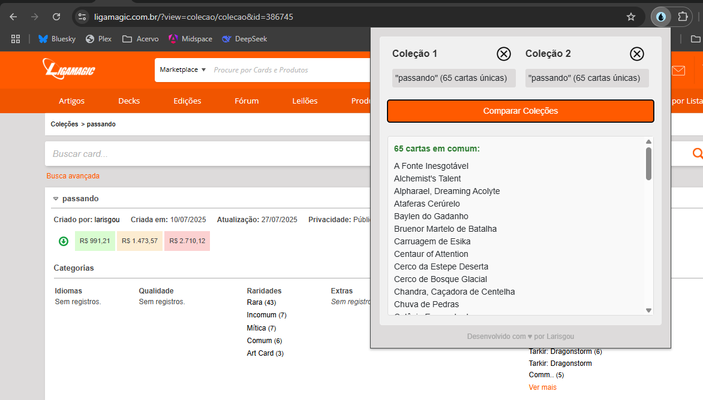

# 📚 LigaMagic Helper

Extensão para Chrome que automatiza a comparação entre coleções de cartas do site [LigaMagic](https://www.ligamagic.com.br)

## ✨ Funcionalidades

- Compara duas coleções abertas em abas diferentes  
- Identifica cartas comuns entre as coleções  
- Exibe resultados em uma interface simples e intuitiva  
- Armazena coleções localmente para comparação posterior  

## 🛠 Como Usar

### Acesse coleções no LigaMagic:
Abra duas abas de coleções com URLs no formato: 
`https://www.ligamagic.com.br/?view=colecao/colecao&id=SEU_ID`

### Capture as coleções:

1. Clique no ícone da extensão  
2. Cique no ícone para carregar **"Coleção 1"** na primeira aba  
3. Cique no ícone para carregar **"Coleção 2"** na segunda aba  

### Compare as coleções:

- Clique em **"Comparar Coleções"**  
- Veja a lista de cartas comuns  

## 🖥 Capturas de Tela

  
*Exemplo: Lista de cartas em comum entre duas coleções*

## ⚙️ Instalação

### Chrome Web Store

- Acesse a página da extensão  
- Clique em **"Adicionar ao Chrome"**

## 📄 Licença

Este projeto está licenciado sob a [MIT License](LICENSE)

## ✉️ Contato

- **Desenvolvedor:** Larissa Henrique
- **Email:** galaxylari@gmail.com
- **GitHub:** [@larishenrique](https://github.com/larishenrique)

---

> **Nota:** Esta extensão não é afiliada ao site LigaMagic. Desenvolvida para fins de auxílio aos colecionadores.
